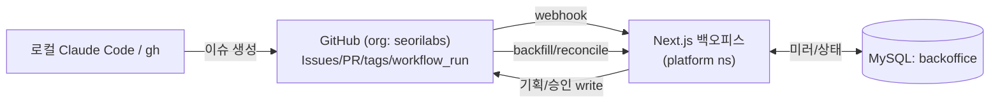

# Seorilabs Backoffice

앱 제작 공장(기획→개발→QA→마켓등록→출시→운영)을 관리·가시화하는 백오피스. K8s(vzyx-cluster)에서 동작하며 GitHub Issues/PR/Actions 를 source of truth 로 미러링하고, 라이프사이클 워크플로우·승인 게이트·마켓별 출시·운영 지속개선을 한 곳에서 본다.

## 무엇을 하는가 (v1)

- **앱/게임 중앙 레지스트리** — org 레포를 스캔(type/engine 분기)해 마켓 식별자·마켓 타겟을 모은다.
- **라이프사이클 워크플로우 보드** — 6단계 칸반(드래그 전이). 배포 성공 시 마켓등록→출시→운영 자동 전이.
- **GitHub 미러** — 이슈/PR/workflow_run/릴리스(파생)를 webhook + reconcile 로 동기화.
- **최소 GitHub write** — 기획 입력 폼→이슈 생성, 승인 라벨 토글, 코멘트.
- **승인 대기 / 마켓 매트릭스 / 운영 개선 미니보드 / 크로스레포 이슈**.
- **GitHub OAuth + allowlist** 인증.

> MiniMax(기획 초안·지표 요약), GA4/LiveOps 지표, 자동 개선 루프는 v2. 인터페이스/자리만 둠.

## 아키텍처



원칙: 모든 쓰기는 `GitHub write → webhook → 미러 upsert` 단방향. 라이프사이클 상태만 백오피스 고유(미러 아님) → mysqldump 백업으로 내구성 확보.

## 스택

Next.js 15 (App Router, standalone) · Auth.js v5 (GitHub) · Prisma 6 + MySQL 9 · Octokit · Tailwind 4 · dnd-kit · ARM64 단일 컨테이너.

## 로컬 개발

```bash
pnpm install
cp .env.example .env       # 값 채우기 (GitHub App, DATABASE_URL 등)
pnpm prisma generate
pnpm prisma migrate deploy # 또는 dev
pnpm dev                   # http://localhost:3000
```

webhook 로컬 수신은 smee.io 등으로 `/api/webhooks` 로 포워딩. 시드는 설정 화면의 "레지스트리 시드" 또는 `POST /api/admin/seed` (헤더 `x-admin-token`).

## 라이프사이클

```
기획 → 개발 → QA → 마켓등록 → 출시 → 운영
        (수동: 보드 드래그)   ↑ 승인     ↑ deploy workflow_run 성공 시 자동
```

배포/운영 절차는 [`docs/DEPLOY.md`](docs/DEPLOY.md) 참고.

<!-- ci cache warm test 151eba1 -->
