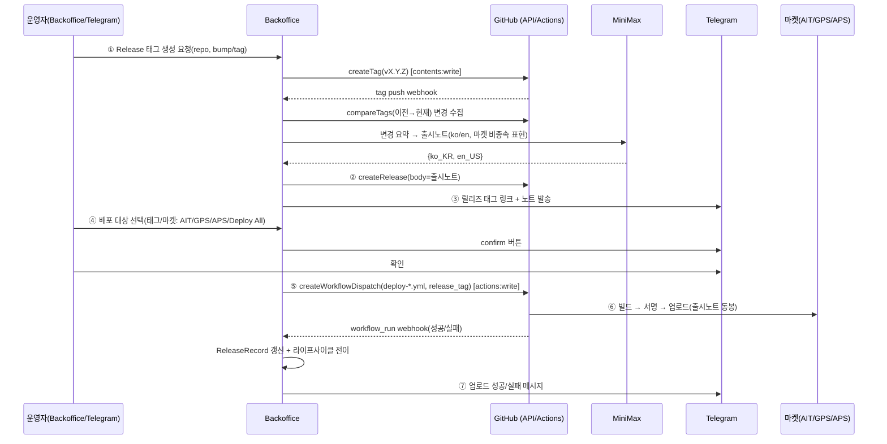
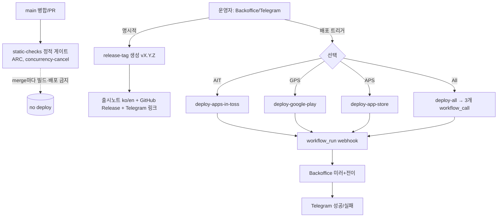

# Seorilabs Org CI/CD & 릴리즈 시스템 (통일 설계)

> 상태: 설계 확정안(v1). 적용 대상: `seorilabs` org 전체.
> 작성 근거: 2026-06-30 org 전수 점검(23개 활성 repo) + 성숙 repo(happy-farm/crossword-puzzle/lucid-chess) 실제 워크플로우 분석 + `global-versions.yaml` + org Actions secrets/variables 실측.
> 이 문서가 org 전체 CI/CD의 single source of truth다. 변경 시 이 문서 → `seorilabs/.github` 재사용 워크플로우 → 각 repo caller 순서로 반영한다.

---

## 0. 배경과 문제

- 월초 GitHub Actions 분(minutes) 쿼터를 고려하지 않고 **main 병합마다 무거운 빌드(AIT/Android/iOS/Godot export)가 동시다발 실행**되어 쿼터가 빨리 소진 → 론칭 파이프라인이 느려졌다.
- 완화책으로 RPI5에 ARC self-hosted runner를 도입(`seorilabs-rpi-arm64`, `-dind`)했다. 이제 전반 점검으로 **체계를 통일**한다.
- 7/1 쿼터 리셋 기준 Android/iOS 빌드에 3000분을 활용 가능 → 무거운 작업은 ARC로 최대 이전하고, GitHub-hosted 분은 **불가피한 것(Android x64 / macOS Xcode)에만** 쓴다.

### 핵심 원칙 (이 설계의 불변식)

1. **main(=default) 병합 이벤트 = 정적 품질 게이트만.** test/lint/typecheck/style + 정적 게이트. 무거운 빌드/배포 금지.
2. **마켓 업로드 = 명시적 Release/Tag 기준.** 자동 태깅(merge마다) 금지. 태그는 사람이 의도적으로 찍는다.
3. **Release/Tag 후 AIT / GPS / APS는 각각 분리된 액션**으로 존재하고, **Deploy All**로 한 번에도 가능.
4. **RPI ARC에서 돌릴 수 있는 건 최대한 ARC로.** 예외(정책): Android AAB release(x64 `aapt2`), Apple/Xcode(macOS), public PR job → ARC 금지.
5. **운영 진입점은 Backoffice + Telegram.** 태그 생성·출시노트·배포 트리거·결과 알림을 backoffice/telegram에서 수행.
6. **중복 제거 = org 레벨 재사용 워크플로우.** 로직은 `seorilabs/.github`에 한 번만 둔다. 각 repo는 얇은 caller.
7. **아티팩트 retention = 3.** (`retention-days: 3`, 마지막 3개 수준)

---

## 1. 현재 상태 요약 (점검 결과)

### 1.1 repo 아키타입

| 아키타입 | repo | 마켓 타겟 |
|---|---|---|
| **RN 앱(멀티마켓)** | crossword-puzzle, happy-farm, match-picture-app, vocab-swipe, periodic-table-app, dpti-app | AIT + GPS + APS |
| **RN 앱(웹 Pages)** | trait-test-hub | web only |
| **Godot 게임(멀티마켓)** | lucid-chess, lucid-reversi, lizard-tycoon | AIT + GPS (+ APS 일부) |
| **Godot 게임(웹 Pages)** | reascend, spiritgate-defenders, foam-party, slotmachine-game, lord-ledger, alley-market-match, great-voyage | web(Pages) |
| **웹/사이트** | seorilabs-official, presentations(k8s), great-voyage | web / k8s |
| **인프라·운영** | seorilabs-backoffice(Next.js, k8s), gemini-pr-bot | 서비스 |
| **템플릿(기준)** | starter-template-app, starter-template-game | — |
| **org 메타** | .github | 재사용 워크플로우 호스트(예정) |

### 1.2 성숙도 / 기준 repo

- **RN 기준**: `happy-farm`(태그 트리거 3마켓), `crossword-puzzle`(dispatch/`workflow_call` + Deploy All + 버전 리졸버).
- **Godot 기준**: `lucid-chess`(GPS AAB + AIT + Deploy All orchestrator, ARC 라우팅).
- 이 3개의 실제 스텝이 org 표준의 원본이다.

### 1.3 발견된 anomaly (수정 대상)

| # | 문제 | 해당 repo | 조치 |
|---|---|---|---|
| A1 | default 브랜치가 `main`이 아님 | **dpti-app(`develop`)** | `main`으로 전환 + 배포 트리거 정합 |
| A2 | **무거운 빌드/배포가 push→main마다 실행**(쿼터 소진) | match-picture-app, vocab-swipe, periodic-table-app, dpti-app(AIT deploy on push→main) | 정적 게이트로 강등 + 배포는 태그/dispatch로 이전 |
| A3 | Godot Web export + Pages가 push→main마다 | Godot 게임 9개 | 정적 compile 게이트는 유지, Pages 배포는 dispatch 또는 경량 유지(웹 채널이라 허용 가능, 단 export 캐시) |
| A4 | merge마다 자동 태그 생성 | crossword-puzzle(`release-tag.yml` on `workflow_run`) | 자동 태깅 제거 → **명시적 태그만**(원칙 #2) |
| A5 | `concurrency` 취소 누락 | dpti-app/test.yml, periodic-table-app/test.yml, seorilabs-official/check.yaml | concurrency+cancel 추가 |
| A6 | macOS 러너 버전 불일치 | lizard-tycoon(`macos-latest`) | `macos-26`으로 핀 |
| A7 | 러너 라우팅 제각각(`cond` vs 하드코딩 arm64 vs ubuntu) | 다수 | private repo는 ARC로 통일(아래 매트릭스) |
| A8 | retention 제각각(5~7일) | happy-farm 등 | `retention-days: 3` 통일 |

---

## 2. 러너 라우팅 매트릭스 (확정)

`global-versions.yaml` 기준. general `seorilabs-rpi-arm64`(ARM64, min2/max4, Node 24.16.0 사전설치), dind `seorilabs-rpi-arm64-dind`(min0/max1).

| 작업 | 러너 | 근거 |
|---|---|---|
| JS/TS lint·test·typecheck·style | `seorilabs-rpi-arm64` | ARC 우선 |
| 웹 빌드 | `seorilabs-rpi-arm64` | ARC 우선 |
| **AIT(.ait) build + deploy** | `seorilabs-rpi-arm64` | ARC 가능(원칙 #4·#9) |
| Godot compile/quality gate, Godot Web export | `seorilabs-rpi-arm64` | ARC 가능(Godot 4.6.3 ARM64) |
| **Android AAB release + Google Play 업로드** | `ubuntu-latest`(x64) | `aapt2`가 x86-64. ARC 금지 |
| **iOS archive + App Store 업로드** | `macos-26` | Xcode 필요. ARC 금지 |
| ARM64/RPI Docker 빌드 | `seorilabs-rpi-arm64-dind` | dind 전용 |
| k8s 배포(kubectl) | `seorilabs-rpi-arm64` | ARC |
| **public repo의 PR job** | `ubuntu-latest` | ARC는 private 전용(보안). public PR은 ARC 노출 금지 |

> public/private 분기 패턴(템플릿에서 사용):
> `runs-on: ${{ github.event.repository.private && 'seorilabs-rpi-arm64' || 'ubuntu-latest' }}`
> 단, **마켓 배포 워크플로우는 private 전용**이며 항상 정책 러너(ubuntu/macos)를 명시.

```mermaid
flowchart LR
  subgraph ARC["RPI5 ARC (private 전용)"]
    A1[lint/test/typecheck/style]
    A2[web build]
    A3[AIT build+deploy]
    A4[Godot compile/web export]
    A5[k8s deploy]
    A6[(dind) ARM64 Docker]
  end
  subgraph GH["GitHub-hosted (불가피)"]
    B1[Android AAB + Google Play]
    B2[iOS Xcode + App Store]
    B3[public PR jobs]
  end
```

---

## 3. 표준 워크플로우 세트 (아키타입별)

각 repo는 아래 파일명을 **그대로** 쓴다(통일). 로직은 `seorilabs/.github`의 재사용 워크플로우에 있고, 아래는 caller(얇은 호출부)다.

### 3.1 RN 앱

| 파일 | 트리거 | 호출 대상(reusable) | 러너 | 역할 |
|---|---|---|---|---|
| `static-checks.yml` | push/PR→main, dispatch | `rn-static-checks.yml` | ARC | lint/typecheck/test/style + 정적 게이트 |
| `release-tag.yml` | dispatch(+ backoffice/telegram) | `release-tag.yml` | ARC | 명시적 SemVer 태그 생성 + push |
| `deploy-apps-in-toss.yml` | dispatch, `workflow_call` | `rn-deploy-ait.yml` | ARC | .ait build + AIT deploy |
| `deploy-google-play.yml` | dispatch, `workflow_call` | `rn-deploy-google-play.yml` | ubuntu | 서명 AAB + Play 업로드 |
| `deploy-app-store.yml` | dispatch, `workflow_call` | `rn-deploy-app-store.yml` | macos-26 | Xcode archive + App Store 업로드 |
| `deploy-all.yml` | dispatch(+ backoffice/telegram) | (위 3개 `workflow_call`) | — | 한 번에 빌드·배포 |
| `cleanup-actions-storage.yml` | dispatch, cron(선택) | `cleanup-actions-storage.yml` | ARC | 아티팩트/캐시 정리 |

### 3.2 Godot 게임

| 파일 | 트리거 | 호출 대상 | 러너 | 역할 |
|---|---|---|---|---|
| `godot-checks.yml` | push/PR→main, dispatch | `godot-checks.yml` | ARC | import→compile→smoke 정적 게이트 |
| `deploy-godot-pages.yml` | dispatch(권장) / push→main(선택) | `godot-pages.yml` | ARC | Godot Web export + Pages |
| `release-tag.yml` | dispatch | `release-tag.yml` | ARC | 태그 생성 |
| `deploy-apps-in-toss.yml` | dispatch, `workflow_call` | `godot-deploy-ait.yml` | ARC | web export → AIT deploy |
| `deploy-google-play.yml` | dispatch, `workflow_call` | `godot-deploy-google-play.yml` | ubuntu | Godot Android AAB + Play |
| `deploy-app-store.yml`(해당 시) | dispatch, `workflow_call` | `godot-deploy-app-store.yml` | macos-26 | Godot iOS + App Store |
| `deploy-all.yml` | dispatch | (위 `workflow_call`) | — | 한 번에 |
| `cleanup-actions-storage.yml` | dispatch | `cleanup-actions-storage.yml` | ARC | 정리 |

### 3.3 웹/사이트(정적), k8s 서비스

- 정적 사이트: `static-checks.yml`(typecheck+build) + `deploy-pages.yml`(push→main 또는 dispatch). public repo는 ubuntu.
- k8s 서비스(backoffice, presentations): `static-checks` + `deploy.yml`(-dind 빌드 → ARC 배포). 기존 패턴 유지.

---

## 4. org 재사용 워크플로우 카탈로그 (`seorilabs/.github/.github/workflows/`)

`.github`는 **public** repo라 org 전 repo에서 `uses: seorilabs/.github/.github/workflows/<x>.yml@<ref>`로 참조 가능. 로직 단일화 + 자동 전파.

| reusable | 입력(`with`) | 시크릿 | 러너 | 비고 |
|---|---|---|---|---|
| `rn-static-checks.yml` | `node_version`, `install_cmd`, `check_cmds`(줄단위) | inherit | ARC | 명령은 입력으로 주입(repo별 상이 흡수) |
| `godot-checks.yml` | `godot_version`(기본 4.6.3), `smoke_scripts` | inherit | ARC | import→quality gate→smoke |
| `rn-deploy-ait.yml` | `release_tag`, `memo`, `ait_dir`(기본 apps/ait) | inherit(`APPS_IN_TOSS_API_KEY`) | ARC | `pnpm --dir <ait_dir> run deploy --api-key --memo` |
| `godot-deploy-ait.yml` | `release_tag`, `memo`, `wrapper_dir` | inherit | ARC | godot web export → wrapper build → deploy |
| `rn-deploy-google-play.yml` | `release_tag`, `track`, `release_status`, `upload`(bool) | inherit + WIF vars | ubuntu | gradlew bundleRelease + WIF + python 업로드 |
| `godot-deploy-google-play.yml` | `release_tag`, `version_name`, `version_code`, `track`, `release_status` | inherit + WIF | ubuntu | godot --export-release Android |
| `rn-deploy-app-store.yml` | `release_tag`, `ios_scheme`, `ios_workspace`, `ios_bundle_id`, `upload`(bool) | inherit(Apple/ASC) | macos-26 | archive + exportArchive(app-store-connect, upload) |
| `godot-deploy-app-store.yml` | `release_tag`, scheme/bundle | inherit | macos-26 | (lizard-tycoon류) |
| `release-tag.yml` | `target_ref`, `tag`, `bump`(major/minor/patch) | — | ARC | 명시적 SemVer 태그 생성/push(contents:write) |
| `cleanup-actions-storage.yml` | `delete_artifacts`, `delete_caches`, `dry_run` | — | ARC | gh api 기반 정리(검증됨) |

**setup 스텝(v1 = 인라인)**: 재사용 워크플로우가 다른 repo의 로컬 `./.github/actions/*`를 참조할 때 생기는 교차참조 취약성을 피하기 위해, v1은 setup(node/pnpm, Android SDK, Godot 설치, Apple 서명 복원, Firebase config 복원)을 **각 재사용 워크플로우에 인라인**한다. 중복이 커지면 `seorilabs/.github/.github/actions/`의 composite action(`setup-pnpm-workspace`, `install-godot`, `setup-android-build`, `restore-apple-signing` 등)으로 추출하는 것을 후속 과제로 둔다.

> **secrets 모델(실측 기반)**: org 레벨에 `APPS_IN_TOSS_API_KEY`, `APPLE_DISTRIBUTION_CERTIFICATE_*`, `APPLE_KEYCHAIN_PASSWORD`, `APP_STORE_CONNECT_*`, `GOOGLE_PLAY_UPLOAD_*`가 이미 존재. org 변수: `APPLE_TEAM_ID`, `GOOGLE_PLAY_UPLOAD_KEY_ALIAS`, `GOOGLE_WORKLOAD_IDENTITY_PROVIDER`. **앱 특화**(per-repo/per-environment): `APPLE_PROVISIONING_PROFILE_BASE64`, `FIREBASE_*_BASE64`, `GOOGLE_PLAY_SERVICE_ACCOUNT_EMAIL`(repo var). `secrets: inherit`로 org+repo+environment 시크릿이 reusable로 그대로 전달된다.

### GitHub Environments (배포 게이트)
- `apps-in-toss`, `google-play`, `app-store` 환경을 각 repo에 두고, 환경 시크릿/보호 규칙(필요 시 수동 승인)을 건다. 배포 job은 `environment:`로 묶어 감사/보호.

---

## 5. 버전 source of truth

- **태그가 기준.** `vMAJOR.MINOR.PATCH`(stable SemVer)만 허용.
- RN: `scripts/resolve-release-version.mjs`가 태그에서 `version_name`, `android_version_code`(세그먼트 base 1000), `apple_marketing_version`, `apple_build_number`를 파생. (happy-farm/crossword 검증됨)
- Godot: `play-store/google-play.config.json`의 `release.versionName/versionCode`를 읽고 태그(`v$versionName`)와 일치 검증.(lucid-chess)
- → 표준 리졸버를 org 공통 스크립트로 승격(템플릿에 포함). 마켓별 versionCode/buildNumber 충돌은 업로드 직전 검증.

---

## 6. 정적 품질 게이트 (main) — 추가 검토 포함

기본: `lint`, `typecheck`, `test`(core/adapters), `style`(format check).

추가로 도입 권장(정적·경량, ARC에서 무료):
- **format gate**: prettier/eslint `--max-warnings=0` 또는 `format:check`.
- **i18n coverage**: happy-farm `check:i18n` 류(번역 키 누락 검출).
- **balance/spec regression**: 게임 밸런스/스펙 회귀(`check:balance`).
- **architecture boundary**: `check:architecture`(product-core 경계 — Clean Architecture).
- **docs/spec presence**: `check:docs`(릴리즈 문서/스펙 존재).
- **release parity guard**: 마켓 간 빌드 산출물 동등성(`check:release-parity`, crossword).
- **secret scan**: gitleaks(정적, dispatch 또는 PR) — 키 유출 방지.
- **dependency/license**: `pnpm audit --prod`(경고 비차단) + 라이선스 체크(선택).
- **commit/PR 규칙**: PR 제목/`Closes #N`/Conventional Commits(선택, lint-pr).
- **CODEOWNERS + 필수 status check**: main 보호 규칙으로 `static-checks`(+ Godot `godot-checks`)를 required로.

> 무거운 것(빌드/배포)은 절대 게이트에 넣지 않는다. 게이트는 분(minutes)을 거의 쓰지 않게 유지.

---

## 7. Backoffice + Telegram 운영 흐름 (핵심)

운영 진입점은 **Backoffice UI**와 **Telegram**. 둘 다 `GitHub API → workflow → webhook 미러` 단방향 원칙을 따른다. (`AGENTS.md`)

### 7.1 책임 분담 (backoffice 현황 기반)

- 이미 존재: 출시노트(ko/en) 자동 생성(`generateReleaseNoteCore`, MiniMax + GitHub compareTags), `ReleaseNote`/`ReleaseRecord`/`App(marketTargets)` 모델, `/releases` 앱×마켓 매트릭스 UI, Telegram 커맨드 라우터(confirm-button 패턴), webhook 수신 → 미러 → 라이프사이클 자동 전이.
- **추가 필요(gap)**:
  1. GitHub **태그 생성 + Release 발행**(현재 write는 issue/label/comment뿐) → `lib/github/write.ts`에 `createTag`/`createRelease`/`updateRelease` 추가. GitHub App 권한에 `contents:write` 필요.
  2. **workflow_dispatch 트리거**(`octokit.rest.actions.createWorkflowDispatch`) → `lib/github/write.ts`. App 권한 `actions:write` 필요.
  3. `/releases` UI: **태그 선택 + 마켓별/Deploy All 버튼**.
  4. Telegram: `/deploy` 슬래시 + `deploy:` 콜백(confirm-button), 릴리즈 태그 링크 발송.
  5. 성공 알림: dispatch된 deploy의 `workflow_run` webhook → 기존 `ReleaseRecord` + nudge 경로로 자동 성공/실패 메시지(이미 동작).

### 7.2 릴리즈 → 배포 시퀀스



### 7.3 출시노트 규칙
- **마켓 비종속**: "앱스토어/플레이스토어/토스" 등 특정 마켓 명칭·정책 표현 금지. 모든 마켓 공통으로 재사용.
- ko/en 동시 생성. GitHub Release body + 각 마켓 "이번 버전의 새로운 기능"에 동일 텍스트 주입.
- 내부/CI/refactor 변경은 사용자 노트에서 제외(이미 프롬프트에 반영).

### 7.4 스크린샷 (선택 단계)
- (선택1) AIT 빌드 기반 핵심 화면 스크린샷 → Release Description 첨부.
- (선택2) 마켓별 규격 스크린샷 세트 생성(APS: `xcrun simctl io screenshot` 실캡처 가능; GPS: phone/tablet 규격; AIT: 세로 규격).
- (선택3) 업로드 시 마켓별 스크린샷 갱신.
- 우선순위: 기능 완성 후 단계적. 1차 릴리즈에는 미포함 가능.

---

## 8. 트리거 모델 (확정)



- 배포 워크플로우는 **`workflow_dispatch` + `workflow_call`**만(자동 tag-push 트리거는 기본 비활성; 필요 repo만 옵션). backoffice가 dispatch로 구동 → "원하는 태그를 골라" 배포 가능(원칙 #2·#3).
- Deploy All은 `resolve`(최신/지정 태그) → 3개 `workflow_call`(`secrets: inherit`). 마켓별 toggle 입력 제공.

---

## 9. retention / 스토리지 정책
- 모든 `upload-artifact`: `retention-days: 3`.
- xcarchive는 업로드 성공 시 아티팩트 보관 안 함(App Store Connect/Crashlytics에서 dSYM 확보).
- `cleanup-actions-storage.yml`을 org 공통으로 두고 주기 dispatch(또는 cron) 정리.

---

## 10. 적용(rollout) 계획 — 단계적

1. **Phase 0 — 기반(이 설계)**: `seorilabs/.github`에 재사용 워크플로우 + composite actions + 공통 스크립트 + 이 문서 미러. (inert: 참조 전까지 무영향)
2. **Phase 1 — 템플릿(기준 반영)**: `starter-template-app`, `starter-template-game`를 caller 표준으로 전환. 이후 신규 repo는 자동 표준 준수.
3. **Phase 2 — Backoffice/Telegram**: 태그 생성/Release 발행/`workflow_dispatch`/`/deploy`/태그 링크/성공 알림 구현. GitHub App 권한(`contents:write`, `actions:write`) 확장.
4. **Phase 3 — 쿼터 긴급 수정(anomaly)**: A2/A4 우선(push→main 배포 강등, 자동 태깅 제거), A1(dpti-app develop→main), A5/A6/A8.
5. **Phase 4 — 전 repo 마이그레이션**: 성숙 repo(happy-farm/crossword/lucid-chess)는 caller로 점진 치환(이름·retention·트리거 정합), 나머지는 표준 caller 적용. repo별 PR(Ready, 한글).
6. **Phase 5 — 보호 규칙**: main 필수 status check(`static-checks`/`godot-checks`), CODEOWNERS, Environments 보호.

각 repo 변경은 **PR(Ready, 한글 제목/본문, Mermaid 가능 시 포함)**. 적용 전후 `actions:` 권한과 secrets 존재를 점검.

---

## 11. Claude 스킬 보존
- 본 절차를 `seorilabs-org-release-pipeline` 스킬로 보존: 아키타입 판별 → caller 워크플로우 생성/갱신 → secrets/vars/environments 점검 → backoffice/telegram 연동 → 보호 규칙. 기존 `arc-runners`, `generate-release-notes`, `google-play-publishing`, `apple-app-store-registration`, `apps-in-toss-react-native-setup` 스킬과 상호 링크.

---

## 부록 A. 실측 secrets/variables (2026-06-30)

- **Org secrets**: APPS_IN_TOSS_API_KEY, APPLE_DISTRIBUTION_CERTIFICATE_BASE64, APPLE_DISTRIBUTION_CERTIFICATE_PASSWORD, APPLE_KEYCHAIN_PASSWORD, APP_STORE_CONNECT_API_KEY_ID, APP_STORE_CONNECT_ISSUER_ID, APP_STORE_CONNECT_PRIVATE_KEY_BASE64, GOOGLE_PLAY_UPLOAD_KEYSTORE_BASE64, GOOGLE_PLAY_UPLOAD_KEYSTORE_PASSWORD, GOOGLE_PLAY_UPLOAD_KEY_PASSWORD, GEMINI_API_KEY, REGISTRY_USERNAME, REGISTRY_PASSWORD
- **Org variables**: APPLE_TEAM_ID, GOOGLE_PLAY_UPLOAD_KEY_ALIAS, GOOGLE_WORKLOAD_IDENTITY_PROVIDER
- **Repo 레벨(예: happy-farm)**: FIREBASE_ANDROID_GOOGLE_SERVICES_JSON_BASE64, (var) GOOGLE_PLAY_SERVICE_ACCOUNT_EMAIL
- **앱 특화(repo/environment)**: APPLE_PROVISIONING_PROFILE_BASE64, FIREBASE_IOS_GOOGLE_SERVICE_INFO_PLIST_BASE64

## 부록 B. 액션 버전 핀 (global-versions.yaml)
- actions/checkout@v6, actions/setup-node@v6, actions/upload-artifact@v7, docker/setup-buildx-action@v4, actions/setup-java@v5, google-github-actions/auth@v3, actions/configure-pages@v6, actions/upload-pages-artifact@v5, actions/deploy-pages@v5, actions/github-script@v9, actions/cache@v5. Node 24.16.0, Godot 4.6.3-stable.
