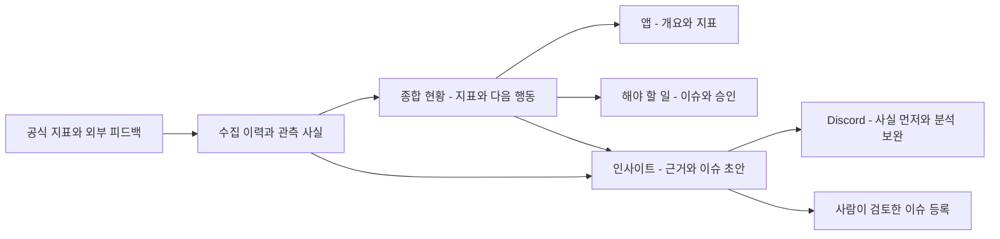

# Backoffice 운영·지표·외부 피드백 통합 설계 v1

- 설계 ID: BO-OPS-20261008-v1
- 기준: origin/main c9cf27635041cbc051cbf179761afc2de92d1f19
- 승인: 대화의 최종 계획에 대한 사용자의 `Implement the plan.` 지시. 구현·검증·PR 범위 승인. 운영 배포·신규 권한·유료 계약·프로덕션 이관은 별도 gate.
- 참고: 다른 세션의 `aso-keyword-rank/docs/design/2026-10-08-app-store-keyword-rank/design.md`. 해당 worktree는 수정하지 않음.

## 목적과 근거

사업 지표와 운영 상태를 첫 화면에서 함께 판단하고 근거 있는 다음 행동으로 연결한다. 중복 메뉴, 분리된 앱 지표, GitHub가 허용하는 자기 승인을 차단하는 로컬 정책, Play 빈 JSON 오류, Discord 이미지의 발신자 누락이 확인됐다. 지표 미수집을 0으로 보이지 않게 하고 수집 이력·보고서 버전·인사이트 근거를 보존한다.

## 화면과 흐름

상위 메뉴: 종합 현황 `/`, 앱 `/apps`, 지표 분석 `/analytics`, 해야 할 일 `/work`, 출시 `/releases`, 피드백·시장 `/feedback`, 플랫폼 `/platform`, 설정 `/settings`.

첫 화면: 기간·수집 상태 → 활성 합계·신규 합계·유지율·광고·결제·비용 → 사용자와 수익 추이 → 긴급 작업과 인사이트 → 앱별 비교. 활성 합계는 앱 사이 사용자 중복을 포함한다. 유지율에는 분모·코호트를 표시한다. 결제 거래액·정산액·광고 추정 수익과 비용의 통화·기간을 구분한다.

앱 탭: 개요·지표·운영·피드백·개발·출시·설정. 운영 하위에서 결제·광고·콘텐츠·기능 설정으로 이동한다. 과거 URL은 동일 기능의 정본으로 연결하며 서비스/RBAC를 재사용한다. 모바일에서는 메뉴 서랍과 카드 순서를 유지한다. 그래프에는 단위·기간·범례, 빈 상태에는 다음 행동을 표시한다.

## 데이터와 책임

- `MetricCollectionLedger`를 지표 수집의 정본으로 유지한다. 기타 소스에는 `SourceCollectionRun`의 시도·성공·실패·범위·최종 데이터 시각을 기록한다.
- `OperationalSignal`: 중복 키, 원본 출처와 관측 시각, 사실, 중요도. 원본 관측을 가공해 허구의 공개 출시를 만들지 않는다.
- `InsightDocument`: 입력 해시, 신호와 근거 참조, 페르소나/모델/프롬프트 버전, 검증된 분석, 상태와 실패 코드. 기존 occurrence/run/lease/event 계약으로 읽기 전용 분석을 실행한다.
- `OrgReportRevision`: 최신 호환 보고서와 별도로 수정 불가능한 과거 버전을 보존한다. 웹·Discord가 같은 보고서와 기간을 읽는다.
- 외부 모니터링 desired state는 기존 `ConfigRevision` validator/service의 앱 범위 설정에 포함한다. 키워드·국가·경쟁 앱·정책 피드를 저장한다. API는 감사·낙관적 동시성·멱등성을 유지한다.
- 리뷰 개인 식별자·본문 원본은 기존 보존 정책을 따른다. 비밀값은 DB/로그/분석 입력에 넣지 않는다.

## 분석과 알림

운영 수석 분석가를 기본 페르소나로 성장·고객·출시·비용·시장 담당을 명시한다. MiniMax는 구조화 JSON을 생성하고 서버가 근거 값을 채워 3–5개 음슴체 불릿, 600자 이하로 렌더한다. 사실·해석 한계·다음 행동 순서이며 가설을 표시한다. 검증 실패는 한 번 재시도하고 결정론적 사실 요약으로 전환한다. 동시 실행 2개·기본 하루 200건 상한, 사용량 기록을 기다린다.

트리거: 지표 변화, 낮은 평점/반복 리뷰, 심사 거절/공개 확인, 출시 1·3·7일 후 변화, 실패/회복, 수집 지연, 비용 변화, 키워드 5위 변화/200위 진입·이탈, 경쟁 앱 업데이트, 관련 공식 정책. 첫 사실 알림은 즉시, 분석은 같은 카드 보완. 반복 사건은 15분 단위 중복 키로 묶는다.

09:00 운영 요약, 23:50 재수집 후 일간 지표, 월요일 10:30 지난 월–일 주간 보고. 누락 기간은 부분 보고로 표시한다. app-ops/ops-alerts/release-ops/user-reviews/metrics-daily 채널을 사건별로 사용한다. 일간·주간 PNG는 실제 관측 값으로 만들고 빈 구간은 끊어서 표시한다.

기존 15개 Discord 명령과 `/report`, `/reviews`, `/keywords`, `/health`, `/insights`는 같은 웹 조회 서비스를 사용한다. 오래 걸리는 조회는 3초 전에 응답을 예약하고 검증된 서버 후속 작업에서 완료한다. 토큰은 15분 유효기간 이내 사용하고 기록하지 않는다. 조회 실패·프로세스 종료 때는 명령을 다시 실행할 수 있으며, 외부 쓰기를 후속 조회 경로에 넣지 않는다.

## 실패와 운영

플랫폼 승인 권한은 GitHub의 `current_user_can_approve`로 판단한다. 로컬에서 실행자와 승인자가 같다는 이유로 재차 금지하지 않는다. 환경 정책·실행 attempt/SHA/대상 해시·CAS·중복 방지·타임아웃 이력 확인은 유지한다. 권한이나 ruleset을 우회하지 않는다.

Play 수집은 빈 응답·권한 실패·부분 성공을 구분하고 정상 트랙의 관측을 보존한다. 동작하지 않는 수집도 건강 상태에서 드러낸다. 신규 유료 공급자는 도입하지 않는다. Apple 검색은 공식 공개 API의 관측 순서이며 기기 검색 순위를 보장하지 않는다.

중앙 설정 이관과 Codex/Claude 루틴은 기존 #156/#158 구현·안전 gate를 보완한다. shadow parity 두 번, build-only, 복구 검증 없는 legacy 삭제는 하지 않는다. 운영 활성화에 필요한 identity·권한·소스가 없으면 `needs_input`으로 표시한다.

## 대안과 결정

기존 지표·중앙 설정·대기열을 확장한다. 독립적인 이중 대기열이나 저장소 JSON 설정을 만들지 않는다. 사용자에게 승인되지 않은 자동 이슈 발행 대신 근거 있는 초안을 사람이 검토해 등록한다. 수집량 확대보다 실패·미적용·미도착의 구분을 먼저 완성한다.

## 인수조건과 검증

1. 원인 재현 테스트가 먼저 실패한 후 승인/Play/Discord 결함이 통과함.
2. 최신 보고서와 수정 이력, 소스별 상태, 숫자 근거와 실패 대체 요약을 검증함.
3. 키워드/경쟁 앱/공식 정책 수집은 공식 API fixture로 중복·지연·실패를 검증함.
4. 읽기 전용 분석 lease·재시도·예산·멱등성·감사와 수동 이슈 초안 등록을 검증함.
5. 격리 개발 DB와 실제 브라우저에서 독립 리뷰 에이전트가 기능·UX 3회 검수함. 각 회차 계획과 증거를 남김.
6. 정확한 후보 SHA의 개발 환경 E2E 후 typecheck/lint/test/build, worker bundle, migration 안전/복구/manifest 검증을 통과함.
7. Ready PR과 required checks green 후 squash merge. 빌드·병합을 운영 배포로 표현하지 않음.

화면·수집·권한이 필요한 테스트에는 격리 DB와 provider mock을 사용한다. 공개 공급자 API 조회가 실제 운영 상태 변경을 요구하는 경로는 fixture로 검증하고 운영 readback을 별도 기록한다. 문서에는 가짜 UI 검수를 붙이지 않는다.

## 적용·복구·추적

추가 테이블과 nullable 필드 중심의 expand-only migration. 기존 최신 보고서·기능 서비스는 유지한다. 이전 이미지로 복구 가능한 스키마를 유지하며 신규 worker·수집기 활성화는 배포 승인을 받기 전 수행하지 않는다. 검증 자료는 이 디렉터리 `validation.md`에서 연결한다. 실행 티켓 [#442](https://github.com/seorilabs/seorilabs-backoffice/issues/442)와 PR은 승인된 설계 ID로 연결한다. main 자동 배포는 수동 workflow_dispatch 조건으로 제한해 구현·병합 승인과 운영 배포 승인을 분리한다. 신규 worker·CronJob 매니페스트는 비활성 상태로 전달한다.
